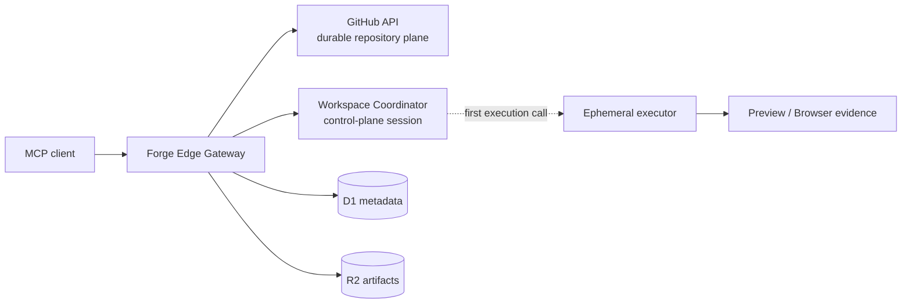

# Architecture

Forge is a GitHub-native coding control plane with lazy ephemeral execution.

## Core Planes

*   **Repository Plane**: GitHub API is the authority for branch CRUD, diffs, commits, history, and PRs. `forge_edit` is the sole public writer, committing directly via GitHub Git Data API. Sandbox pushes are blocked.
*   **Workspace Control Plane**: `forge_workspace_create` registers a lightweight session (metadata, settings, task mappings) without provisioning compute.
*   **Executor Plane**: First shell, test, or build command lazily starts an isolated container and materializes the GitHub commit. Files are ephemeral; `remote_persisted` is false. Workspace teardown deletes the container.

## Subsystems
*   [System Architecture](architecture/system.md)
*   [GitHub Integration](architecture/github.md)
*   [Runtime Allocation](architecture/runtime.md)
*   [Persistence Model](architecture/persistence.md)
*   [Reliability Contract](architecture/reliability.md)
*   [Sequence Diagrams](architecture/sequences.md)
