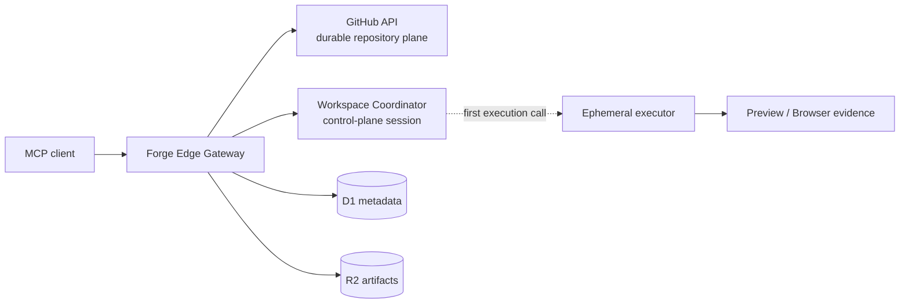

# Architecture

Forge is a GitHub-native coding control plane with lazy ephemeral execution.

## Repository plane

GitHub's API is the sole authority for repository file CRUD, diffs, commits,
branches, history, and pull requests. `forge_edit` is the only public tool that
writes or deletes files. It commits through GitHub's Git Data API and verifies
the updated ref before returning success.

GitHub-only tools do not allocate an executor. Raw `git push` is blocked;
command output can never become a repository commit implicitly.

## Workspace control plane

`forge_workspace_create` creates a lightweight session containing repository,
branch, runtime preference, revision, idempotency, process, preview, and task
metadata. It returns immediately and provisions no compute.

## Executor plane

The first shell, dependency install, build, test, dev, preview, or deploy call
allocates an isolated executor and materializes the selected GitHub commit.
Executor files are ephemeral. Command-created changes are never auto-committed
and report `remote_persisted:false`; recreate wanted changes with `forge_edit`.

Artifacts support bounded logs and evidence, not repository durability.
Destroying the session discards executor-only state; recovery materializes a
fresh checkout from GitHub while GitHub commits remain.

Detailed views:

- [System architecture](architecture/system.md)
- [GitHub architecture](architecture/github.md)
- [Runtime architecture](architecture/runtime.md)
- [Persistence](architecture/persistence.md)
- [Reliability contract](architecture/reliability.md)
- [Sequences](architecture/sequences.md)
