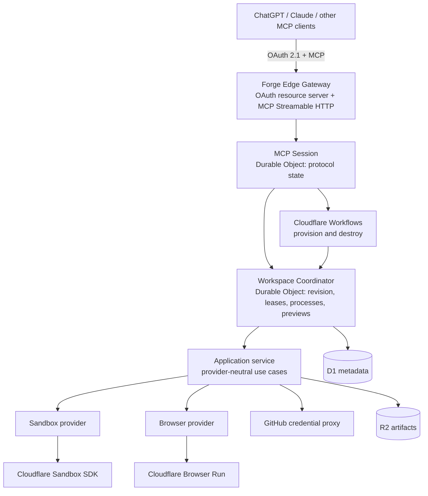

# Architecture

Forge separates intelligence from execution. An MCP client (ChatGPT, Claude, or
any MCP-compatible agent) chooses actions; Forge authenticates, authorizes,
coordinates, executes, records evidence, and returns stable results.

## Building blocks

- **Forge Edge Gateway** (`apps/forge-edge-gateway`) — the single Cloudflare
  Worker: HTTP routing, the OAuth authorization/resource server, the MCP
  Streamable HTTP endpoint, and the preview proxy.
- **MCP Session** — a Durable Object holding protocol state, client
  capabilities, and request correlation for one connected client.
- **Workspace Coordinator** — one Durable Object per workspace. Owns the
  monotonic revision counter, idempotency keys, lease state, mutation
  serialization, running processes, previews, and reconciliation to D1.
- **Cloudflare Workflows** — durable provision/destroy orchestration
  (`ProvisionWorkspaceWorkflow`, `DestroyWorkspaceWorkflow`). A workflow drives
  the coordinator; it does not own live workspace state itself.
- **Application service** (`packages/application`) — provider-neutral use
  cases and stable Forge errors. Provider identifiers (Cloudflare, GitHub
  internals) never cross the public MCP contract.
- **Providers** — `packages/sandbox-cloudflare` (Cloudflare Sandbox SDK,
  containers), `packages/sandbox-selfhosted` (a self-hosted compute agent,
  e.g. a Mac mini, with health-check fallback to Cloudflare), Browser Run
  (screenshots/accessibility), a GitHub App credential proxy for Git.

## Cloudflare bindings (`infra/wrangler/forge.jsonc`)

- **D1** (`METADATA` binding, database `forge-production`) — tasks, workspaces,
  OAuth clients/codes, capability nonces, review-workspace bindings. Migrations
  live in `migrations/d1/` and are applied in order (`0001`…`0011` today).
- **R2** (`ARTIFACTS` binding, bucket `forge-production-artifacts`) — stored
  screenshots/evidence, workspace snapshots, and the per-repo dependency cache.
- **Durable Objects** — `Sandbox`, `ForgeMcpSession`, `WorkspaceCoordinator`.
- **Workflows** — `ProvisionWorkspaceWorkflow`, `DestroyWorkspaceWorkflow`.
- **Containers** — one `Sandbox` container class, `basic` instance type, capped
  at 8 concurrent instances (`max_instances`); idle instances sleep after 90s.
- **Browser Run** (`BROWSER` binding) and **Workers AI** (`AI` binding, used to
  auto-generate commit messages/PR titles from diffs) — both bindings, no
  external API keys.
- A scheduled cron (`*/5 * * * *`) drives the global slot reaper and the
  stuck-provisioning watchdog (see [operations.md](operations.md)).

## Workspaces and sandboxing

A **workspace** is a disposable, isolated Linux sandbox created from an
authorized GitHub repository. Each workspace runs in its own container with no
ambient GitHub or production credentials; Git access is brokered through a
short-lived credential-proxy capability instead. Only `forge/`-namespaced
branches can be pushed, and pushing plus PR creation require a real user
approval.

Workspace mutations (writes, patches, shell, git operations) carry an
`idempotency_key` and an `expected_revision` — the Workspace Coordinator
serializes mutations and rejects stale revisions, so retries and concurrent
calls stay safe.

## Durable tasks

A **task** (`forge_task_*`) is a durable coding-session record — goal,
decisions, non-goals, likely paths, branch, workspace, evidence — that
survives MCP reconnects, context compression, and container sleep. Creating a
task never starts a container; a workspace is attached only when execution is
actually needed. This lets an agent resume a multi-turn session cheaply via
`forge_task_summary` without replaying prior tool calls.

## Review evidence (Parallax)

`forge_review` and `forge_review_capture` produce screenshot and accessibility
evidence for a URL or a live preview, including scripted interaction steps
(click/fill/press/wait) so multi-step flows can be proven, not just a static
screenshot. See [parallax.md](parallax.md) for the review contract this
evidence feeds into.

## Implemented vertical slice

The deployed private pilot implements: GitHub-backed OAuth identity, GitHub
App repository authorization, public and private Git clone through scoped
capabilities, explicit Sandbox sessions, idempotent workspace creation,
durable provision/destroy workflows, deterministic project detection and
bootstrap, file tree/read/write/patch, bounded shell commands and background
processes, Git status/diff/branch/commit, approval-gated push and draft PR
creation, private preview capabilities, Browser Run screenshot/accessibility
capture, durable tasks, deterministic context/diff insight tools, workspace
revisions and mutation serialization, and D1-backed reconciliation and
teardown.

Full egress enforcement beyond the current network-policy modes, and a
production-grade multi-tenant approval UI, remain open work — see
[security.md](security.md) for what is and is not enforced today.
