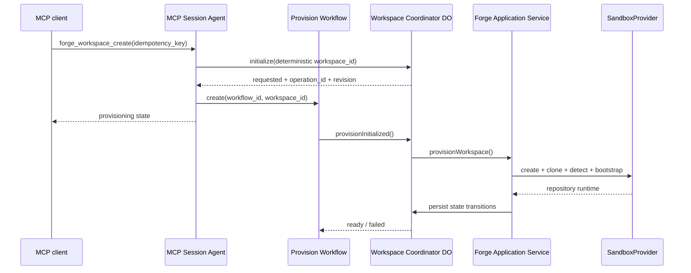
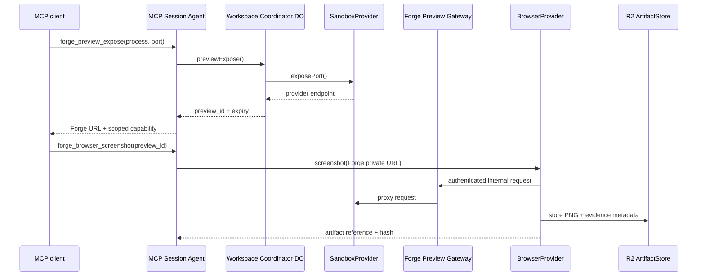
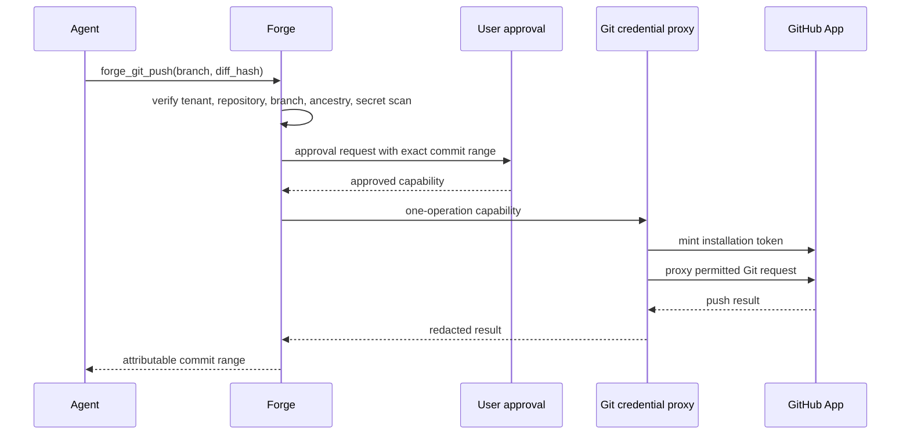

# Forge sequence diagrams

## Workspace provisioning

```mermaid
sequenceDiagram
  participant C as MCP client
  participant M as MCP Session Agent
  participant W as Provision Workflow
  participant D as Workspace Coordinator DO
  participant A as Forge Application Service
  participant S as SandboxProvider

  C->>M: forge_workspace_create(idempotency_key)
  M->>D: initialize(deterministic workspace_id)
  D-->>M: requested + operation_id + revision
  M->>W: create(workflow_id, workspace_id)
  M-->>C: provisioning state
  W->>D: provisionInitialized()
  D->>A: provisionWorkspace()
  A->>S: create + clone + detect + bootstrap
  S-->>A: repository runtime
  A->>D: persist state transitions
  D-->>W: ready / failed
```

## Private preview and browser evidence

```mermaid
sequenceDiagram
  participant C as MCP client
  participant M as MCP Session Agent
  participant D as Workspace Coordinator DO
  participant S as SandboxProvider
  participant P as Forge Preview Gateway
  participant B as BrowserProvider
  participant R as R2 ArtifactStore

  C->>M: forge_preview_expose(process, port)
  M->>D: previewExpose()
  D->>S: exposePort()
  S-->>D: provider endpoint
  D-->>M: preview_id + expiry
  M-->>C: Forge URL + scoped capability
  C->>M: forge_browser_screenshot(preview_id)
  M->>B: screenshot(Forge private URL)
  B->>P: authenticated internal request
  P->>S: proxy request
  B->>R: store PNG + evidence metadata
  B-->>M: artifact reference + hash
```

## Phase 2 push path

```mermaid
sequenceDiagram
  participant A as Agent
  participant F as Forge
  participant U as User approval
  participant G as Git credential proxy
  participant GH as GitHub App

  A->>F: forge_git_push(branch, diff_hash)
  F->>F: verify tenant, repository, branch, ancestry, secret scan
  F->>U: approval request with exact commit range
  U-->>F: approved capability
  F->>G: one-operation capability
  G->>GH: mint installation token
  G->>GH: proxy permitted Git request
  GH-->>G: push result
  G-->>F: redacted result
  F-->>A: attributable commit range
```
