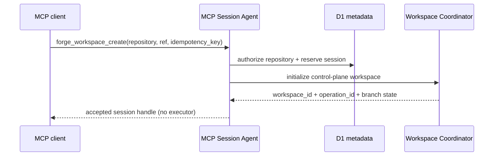
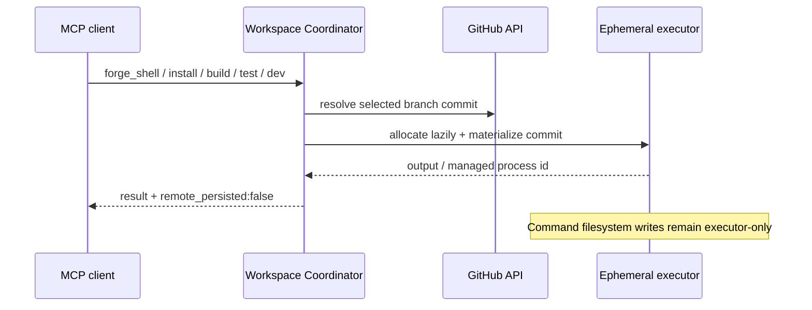
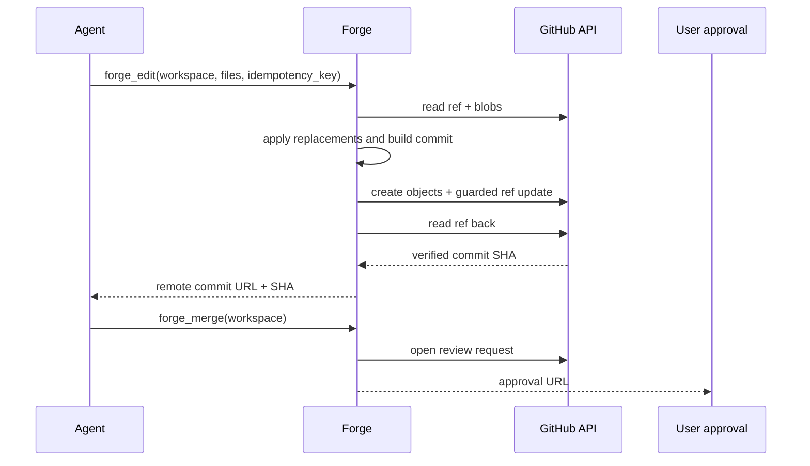
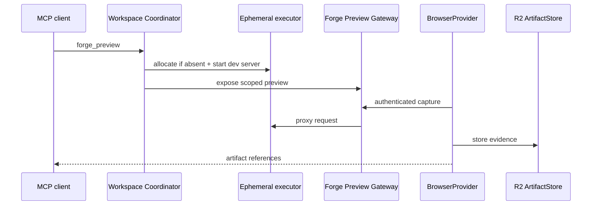
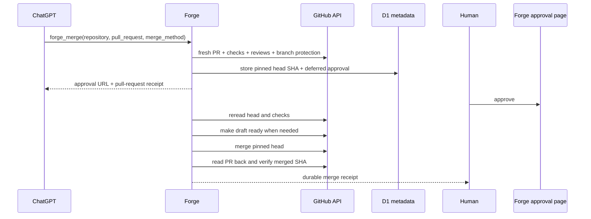

# Forge Sequence Diagrams

## 1. Workspace Creation

```mermaid
sequenceDiagram
  MCP client->>MCP Session Agent: forge_workspace_create(repository, ref, idempotency_key)
  MCP Session Agent->>D1 metadata: authorize repository + reserve session
  MCP Session Agent->>Workspace Coordinator: initialize control-plane workspace
  Workspace Coordinator-->>MCP Session Agent: workspace_id + operation_id + branch state
  MCP Session Agent-->>MCP client: accepted session handle (no executor)
```

## 2. Lazy Executor Command

```mermaid
sequenceDiagram
  MCP client->>Workspace Coordinator: forge_shell / install / build / test / dev
  Workspace Coordinator->>GitHub API: resolve selected branch commit
  Workspace Coordinator->>Ephemeral executor: allocate lazily + materialize commit
  Ephemeral executor-->>Workspace Coordinator: output / managed process id
  Workspace Coordinator-->>MCP client: result + remote_persisted:false
  Note over Ephemeral executor: Command filesystem writes remain executor-only
```

## 3. Remote Edit & Review

```mermaid
sequenceDiagram
  Agent->>Forge: forge_edit(workspace, files, idempotency_key)
  Forge->>GitHub API: read ref + blobs
  Forge->>Forge: apply replacements and build commit
  Forge->>GitHub API: create objects + guarded ref update
  Forge->>GitHub API: read ref back
  GitHub API-->>Forge: verified commit SHA
  Forge-->>Agent: remote commit URL + SHA
  Agent->>Forge: forge_merge(workspace)
  Forge->>GitHub API: open review request
  Forge-->>User approval: approval URL
```

## 4. Private Preview & Evidence

```mermaid
sequenceDiagram
  MCP client->>Workspace Coordinator: forge_preview
  Workspace Coordinator->>Ephemeral executor: allocate if absent + start dev server
  Workspace Coordinator->>Forge Preview Gateway: expose scoped preview
  BrowserProvider->>Forge Preview Gateway: authenticated capture
  Forge Preview Gateway->>Ephemeral executor: proxy request
  BrowserProvider->>R2 ArtifactStore: store evidence
  BrowserProvider-->>MCP client: artifact references
```

## 5. Direct-chat Pull-request Merge

```mermaid
sequenceDiagram
  ChatGPT->>Forge: forge_merge(repository, pull_request, merge_method)
  Forge->>GitHub API: fresh PR + checks + reviews + branch protection
  Forge->>D1 metadata: store pinned head SHA + deferred approval
  Forge-->>ChatGPT: approval URL + pull-request receipt
  Human->>Forge approval page: approve
  Forge->>GitHub API: reread head and checks
  Forge->>GitHub API: make draft ready when needed
  Forge->>GitHub API: merge pinned head
  Forge->>GitHub API: read PR back and verify merged SHA
  Forge-->>Human: durable merge receipt
```
