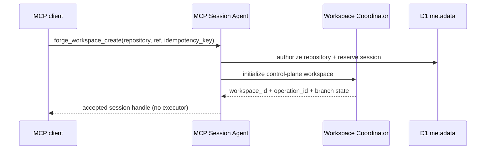
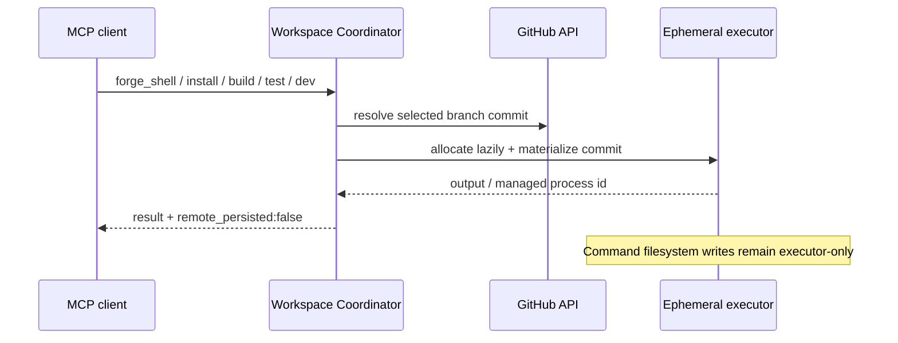
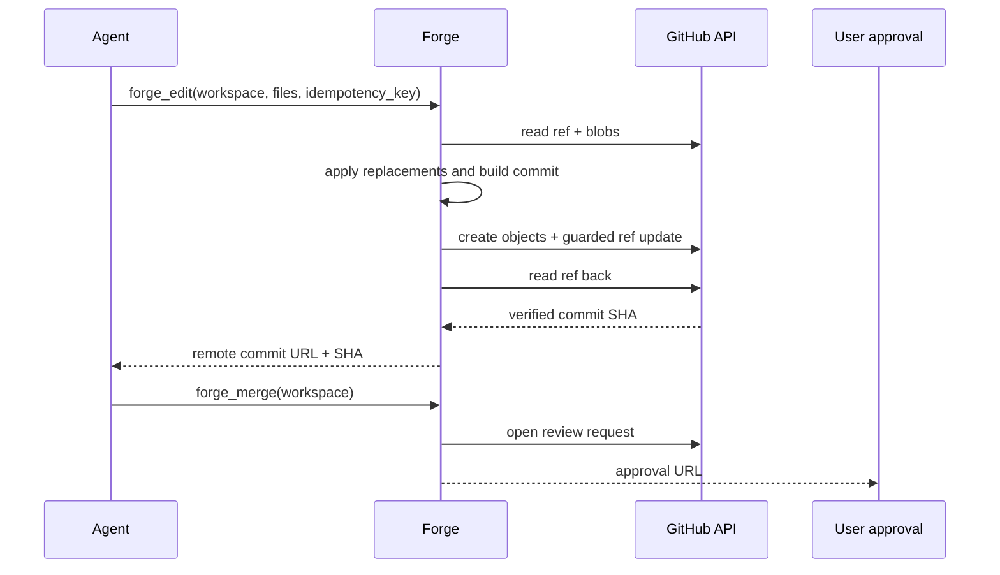
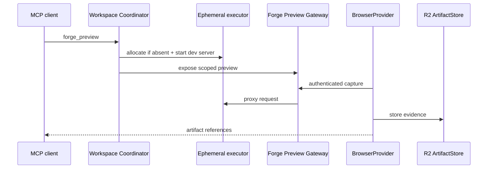

# Forge sequence diagrams

## Control-plane workspace creation

```mermaid
sequenceDiagram
  participant C as MCP client
  participant M as MCP Session Agent
  participant D as Workspace Coordinator
  participant DB as D1 metadata

  C->>M: forge_workspace_create(repository, ref, idempotency_key)
  M->>DB: authorize repository + reserve session
  M->>D: initialize control-plane workspace
  D-->>M: workspace_id + operation_id + branch state
  M-->>C: accepted session handle (no executor)
```

## Lazy executor command

```mermaid
sequenceDiagram
  participant C as MCP client
  participant D as Workspace Coordinator
  participant GH as GitHub API
  participant E as Ephemeral executor

  C->>D: forge_shell / install / build / test / dev
  D->>GH: resolve selected branch commit
  D->>E: allocate lazily + materialize commit
  E-->>D: output / managed process id
  D-->>C: result + remote_persisted:false
  Note over E: Command filesystem writes remain executor-only
```

## Remote edit and review

```mermaid
sequenceDiagram
  participant A as Agent
  participant F as Forge
  participant GH as GitHub API
  participant U as User approval

  A->>F: forge_edit(workspace, files, idempotency_key)
  F->>GH: read ref + blobs
  F->>F: apply replacements and build commit
  F->>GH: create objects + guarded ref update
  F->>GH: read ref back
  GH-->>F: verified commit SHA
  F-->>A: remote commit URL + SHA
  A->>F: forge_merge(workspace)
  F->>GH: open review request
  F-->>U: approval URL
```

## Private preview and evidence

```mermaid
sequenceDiagram
  participant C as MCP client
  participant D as Workspace Coordinator
  participant E as Ephemeral executor
  participant P as Forge Preview Gateway
  participant B as BrowserProvider
  participant R as R2 ArtifactStore

  C->>D: forge_preview
  D->>E: allocate if absent + start dev server
  D->>P: expose scoped preview
  B->>P: authenticated capture
  P->>E: proxy request
  B->>R: store evidence
  B-->>C: artifact references
```
