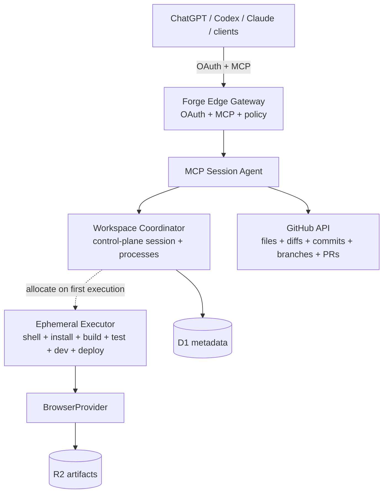

# Forge System Architecture

Separates durable repository control from ephemeral execution.

## Durable Boundaries

- **GitHub API:** Sole durable repo CRUD, diff, commit, branch, history, and PR plane.
- **D1 & Coordinator:** Workspace identity, revisions, idempotency, process handles, previews, audit/recovery metadata.
- **R2 Artifacts:** Bounded logs, screenshots, evidence (does not convert executor files to repo changes).
- **Executor:** Lazy/ephemeral runner for commands, installs, builds, tests, dev servers, previews, deploys.

## Trust & Mutation Rules

1. Client and repository content are untrusted.
2. Executor is an isolation boundary, not a repository authority.
3. `forge_edit` is sole public repository file writer/deleter.
4. Executor command writes remain local and uncommitted (`remote_persisted:false`).
5. External side effects require fresh authorization at execution time.
6. GitHub mutations enforce expected-state guards and provider read-back before success.

## Implemented Surface (Private Pilot)

- **Auth & Session:** GitHub-backed identity/auth, durable tasks, lightweight coding sessions.
- **Repo Operations:** GitHub-native file reads/edits, diffs, history, branches, PRs.
- **Execution & Security:** Lazy managed execution, private previews, Browser Run evidence, encrypted secret attachments, Cloudflare deployment receipts.
