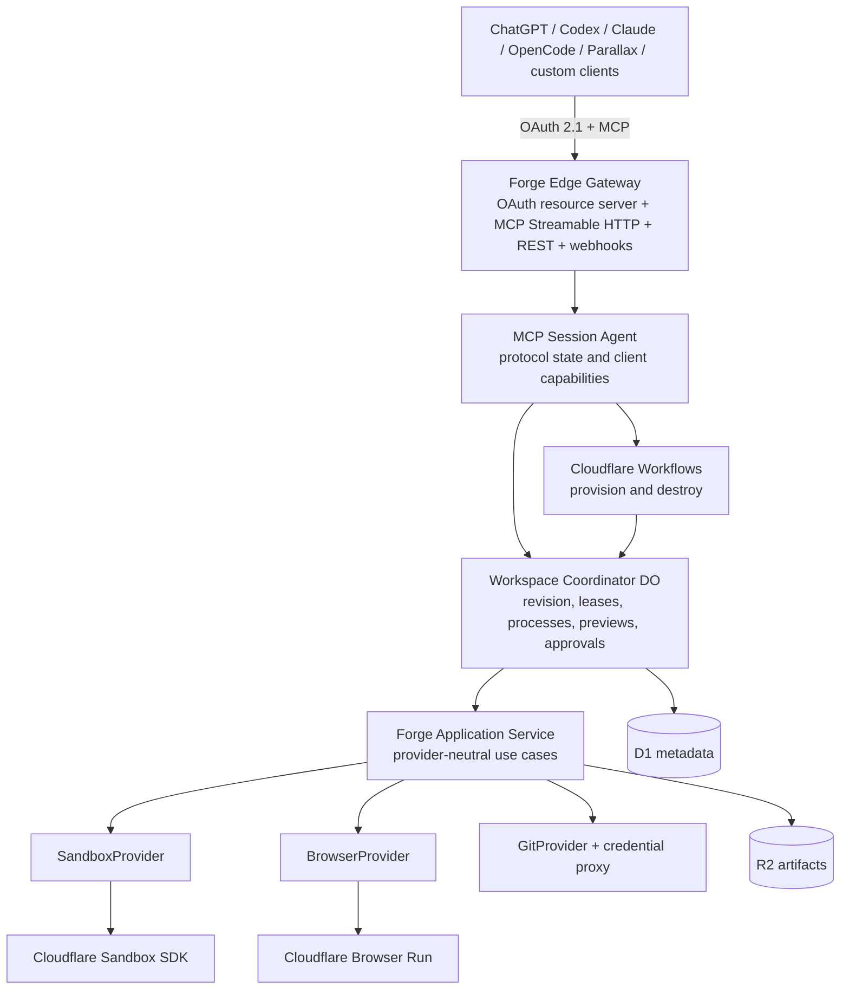

# Forge system architecture

Forge separates intelligence from execution. MCP clients choose actions; Forge authenticates, authorizes, coordinates, executes, records evidence, and exposes stable results.

## Durable boundaries

- **MCP Session Agent:** protocol state, client capabilities, request correlation and subscriptions. One session may use several workspaces.
- **Workspace Coordinator:** one object per workspace, monotonic revision, idempotency, lease state, mutation serialization, processes, previews and reconciliation to D1.
- **Workflow:** durable provisioning/destruction orchestration. It invokes the coordinator rather than owning live workspace state.
- **Application service:** provider-neutral use cases and stable Forge errors.
- **Providers:** Cloudflare Sandbox, Browser Run, R2, D1 and later GitHub are adapters; their identifiers do not cross the public MCP contract.

## Trust boundaries

1. The client is untrusted input, even after authentication.
2. Repository content and every command it can trigger are hostile.
3. The sandbox is an execution boundary, not an authorization authority.
4. The application layer owns policy and never exposes provider identifiers as the public contract.
5. External side effects require fresh authorization at execution time.

## Implemented vertical slice

The current foundation implements GitHub-backed identity, installation repository synchronization, public and private Git clone through scoped capabilities, explicit Sandbox sessions, deterministic idempotent workspace creation, durable provisioning and destruction workflows, deterministic project detection, file tree/read/patch, bounded shell commands, background processes, Git status/diff, `forge/` branches, bot commits, approval-gated pushes and draft PRs, private preview capabilities, Browser Run screenshot/accessibility snapshots, workspace revisions, mutation serialization, D1 reconciliation and teardown.

The deployed private pilot includes OAuth consent, public clone and the complete review-evidence path. The private Git credential proxy, push/PR approval, suspension/restore workflows and full egress enforcement remain release gates. Their contracts and ADRs exist; the code does not pretend they are complete.
