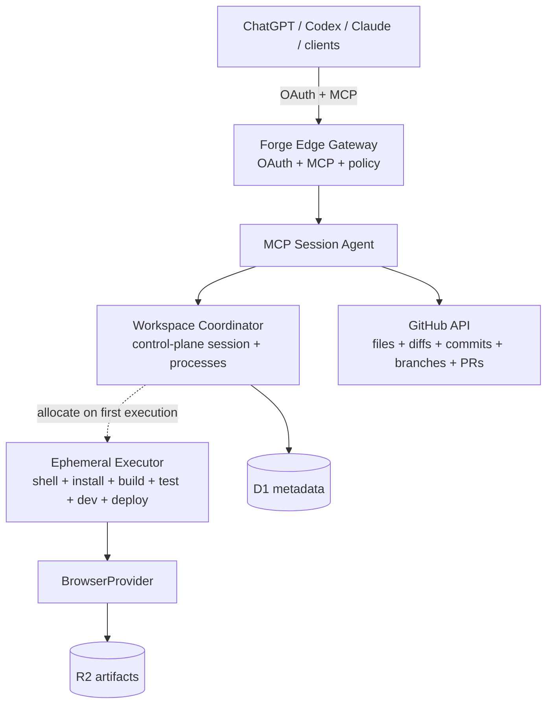

# Forge system architecture

Forge separates durable repository control from ephemeral execution.

## Durable boundaries

- **GitHub API:** sole durable repository file CRUD, diff, commit, branch,
  history, and pull-request plane.
- **D1 and coordinator state:** control-plane workspace identity, revisions,
  idempotency, process handles, previews, and audit/recovery metadata.
- **R2 artifacts:** bounded logs, screenshots, and evidence. Artifacts do not
  turn executor files into repository changes.
- **Executor:** lazy and ephemeral. It exists only for commands, installs,
  builds, tests, dev servers, previews, and deploys.

## Trust and mutation rules

1. The client and repository content are untrusted input.
2. The executor is an isolation boundary, not a repository authority.
3. `forge_edit` is the only public repository file writer/deleter.
4. Executor command writes remain local to that executor and are never
   auto-committed; process results report `remote_persisted:false`.
5. External side effects require fresh authorization at execution time.
6. GitHub mutations use expected-state guards and provider read-back before
   Forge reports success.

## Implemented surface

The private pilot combines GitHub-backed identity and repository authorization,
durable tasks and lightweight coding sessions, GitHub-native file reads/edits,
diffs/history/branches/PRs, lazy managed execution, private previews, Browser
Run evidence, encrypted secret attachments, and verified Cloudflare deployment
receipts.
