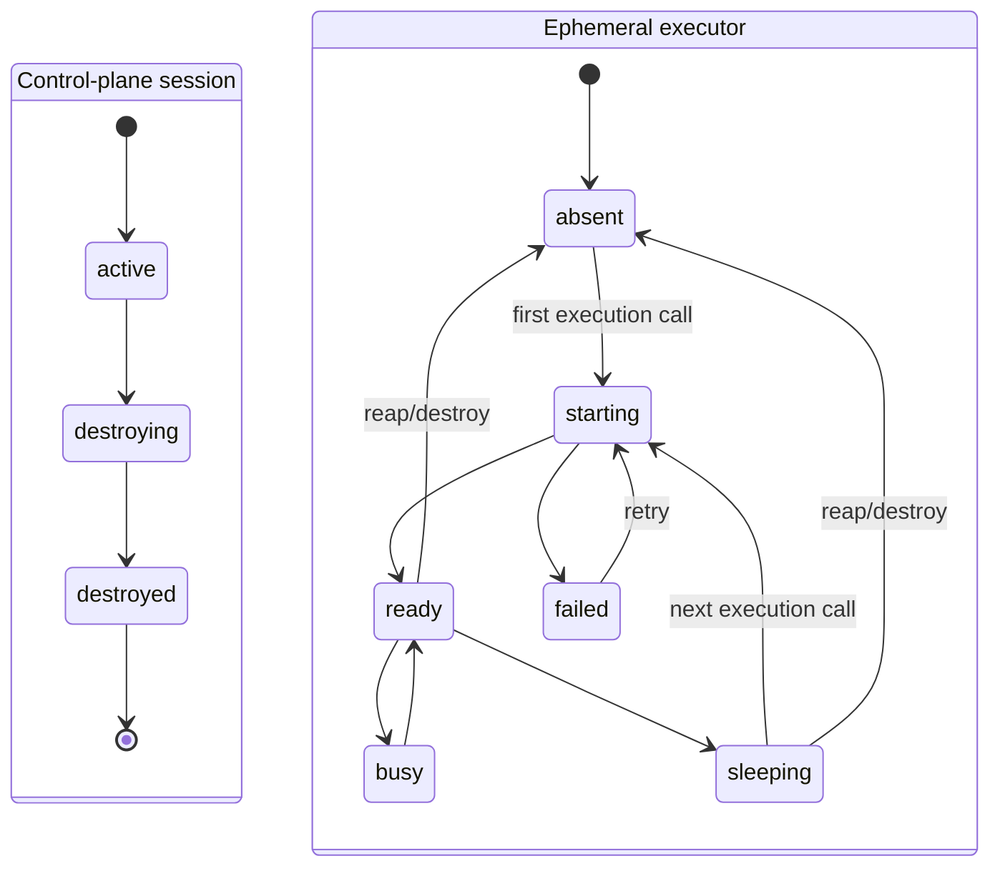

# Workspace state model

The durable control-plane session and ephemeral executor have separate state.

D1 and the Workspace Coordinator store the control-plane record and observed
executor/process state. GitHub remains repository truth in every executor
state. Recreating or destroying an executor may discard command-created files;
it never discards a `forge_edit` commit.
