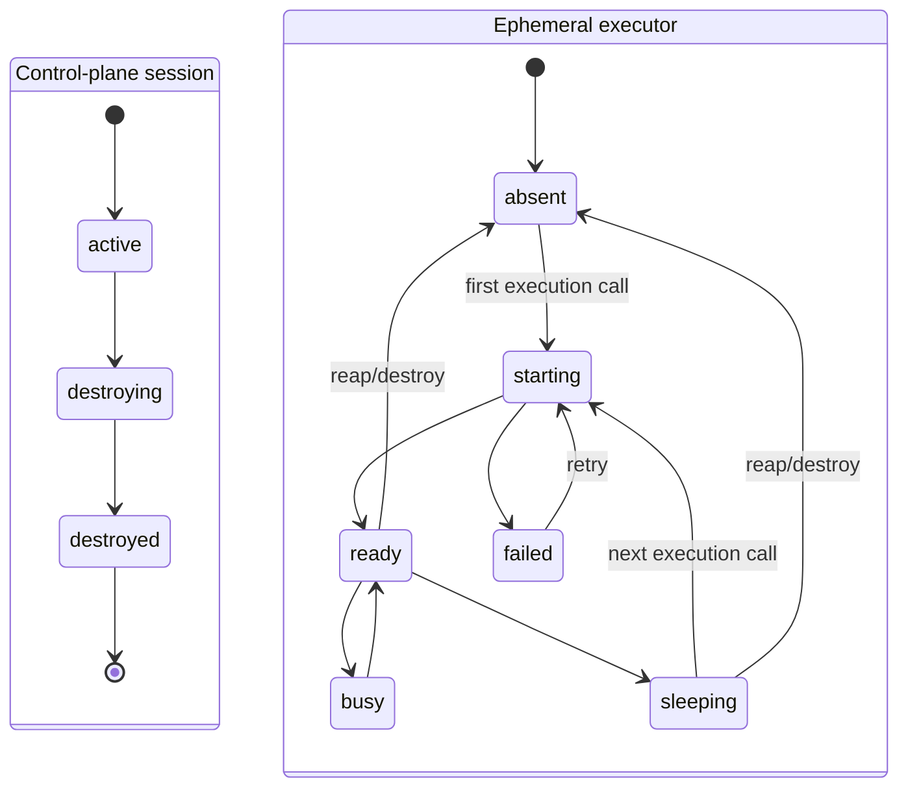

# Workspace State Model

Separated control-plane session and ephemeral executor state models.

- **D1 & Workspace Coordinator:** Store control-plane record & observed executor/process state.
- **GitHub:** Repository truth in all executor states.
- **Persistence Invariant:** Executor reap/destroy discards command-created files; `forge_edit` commits survive.
