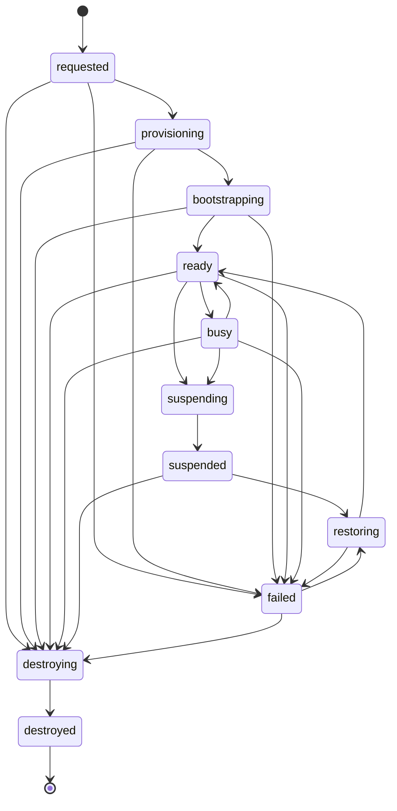

# Workspace state machine

The Durable Object stores the live revision and serialized mutation sequence. D1 stores the globally queryable copy. A provider responding does not by itself define the Forge lifecycle state.
